import { getBlogMetadata } from '@/utils/seo';
export const metadata = getBlogMetadata('ai-air-quality');


# Predicting Air Quality with XGBoost & Gemini

*March 2026 • 15 min read*

---

> **Hook**: You open your weather app and it says "AQI: 112". What does that mean? Should you go for a run? Can you leave the windows open? Most environmental dashboards just spit raw numbers at users without any actionable context. And worse, they tell you what the air quality is *right now*, not what it will be in three hours when you actually plan to go outside.

I built **AetherAI** to solve two major problems in environmental tracking:
1. **Forecasting**: Predicting future Air Quality Index (AQI) based on current meteorological trends.
2. **Contextualization**: Translating raw numbers into human-readable advice.

In this deep dive, we'll explore how I combined classical Machine Learning (**XGBoost**) for highly accurate time-series prediction with a Large Language Model (**Google Gemini**) to generate contextual, actionable insights.

---

## 1. Problem Statement

Most air quality apps rely on static data pulled from government APIs. These systems face several scaling and UX challenges:
- **API Rate Limits**: Polling a third-party API every time a user loads the app is expensive and slow.
- **Missing Data**: Sensors frequently go offline. If a sensor drops out, traditional dashboards just show a blank space or an error.
- **Cognitive Overload**: "PM2.5 is 45 µg/m³" is technically accurate but practically useless to the average person.

AetherAI is designed to ingest raw sensor data, impute missing values, predict the trajectory of the pollutants using an XGBoost model, and finally pass those predictions to an LLM to generate plain-english advice.

---

## 2. System Architecture

AetherAI is built on a decoupled, API-first architecture designed for rapid inference.

```mermaid
graph TD
    subgraph Client Layer
        A["React Frontend"]
    end

    subgraph API Layer
        B["FastAPI Service"]
    end

    subgraph Data Layer
        C[("SQLite (Local Cache)")]
        D["External AQI APIs"]
    end

    subgraph AI/ML Layer
        E["XGBoost Predictor"]
        F["Google Gemini API"]
    end

    A <-->|"REST (JSON)"| B
    B -->|"Fetch Raw Data"| D
    B <-->|"Cache & Store"| C
    B -->|"Extract Features"| E
    E -->|"Forecasted AQI"| B
    B -->|"Prompt + Context"| F
    F -->|"Human-readable Advice"| B

    style A fill:#1e1e24,stroke:#3b82f6,stroke-width:2px
    style B fill:#1e1e24,stroke:#10b981,stroke-width:2px
    style E fill:#1e1e24,stroke:#ef4444,stroke-width:2px
    style F fill:#1e1e24,stroke:#a855f7,stroke-width:2px
```



### Component Breakdown
1. **React Frontend**: A lightweight, responsive dashboard that visualizes the AQI trends using Recharts.
2. **FastAPI Service**: The orchestration layer. It handles the heavy lifting of routing data between the database, the ML model, and the external LLM.
3. **XGBoost Engine**: A highly optimized gradient boosting framework perfect for tabular meteorological data.
4. **Google Gemini**: Acts as the "translator", taking the XGBoost output and creating conversational insights.

---

## 3. The Machine Learning Engine (XGBoost)

Why XGBoost and not a Deep Learning model like an LSTM?

While LSTMs are great for time-series, they are computationally expensive and require massive amounts of data to avoid overfitting. AQI data is highly tabular (Temperature, Humidity, Wind Speed, PM2.5, PM10). For tabular data, **tree-based ensemble models** like XGBoost or LightGBM consistently outperform deep learning in both accuracy and training time.

### Handling Missing Data
Air quality sensors are notoriously unreliable. XGBoost has a massive advantage here: it handles `NaN` values natively during the branch splitting process. I didn't have to write complex imputation pipelines (like Mean/Median filling) which can skew predictions.

```python
import xgboost as xgb
import pandas as pd

# Load the trained XGBoost model
bst = xgb.Booster()
bst.load_model('models/aetherai_xgboost_v1.json')

def predict_future_aqi(current_weather: dict):
    # Convert incoming JSON to DMatrix, XGBoost's optimized data structure
    df = pd.DataFrame([current_weather])
    dtrain = xgb.DMatrix(df)
    
    # Predict the AQI 3 hours into the future
    forecast = bst.predict(dtrain)
    return float(forecast[0])
```

---

## 4. Contextualization with LLMs (Google Gemini)

Once we have the predicted AQI, we need to translate it. This is where the **Prompt Engineering** comes in.

Instead of writing hundreds of `if/else` statements (`if aqi > 100: return "Bad air"`), I pass the forecast to Google Gemini with a highly constrained system prompt.

```python
import google.generativeai as genai
import os

genai.configure(api_key=os.environ["GEMINI_API_KEY"])
model = genai.GenerativeModel('gemini-pro')

def generate_user_advice(aqi_forecast: float, user_profile: str = "general"):
    prompt = f"""
    You are an environmental health assistant. 
    The forecasted Air Quality Index (AQI) for the next 3 hours is {aqi_forecast}.
    
    Based on this, provide a 2-sentence actionable piece of advice for a person with a '{user_profile}' health profile.
    Do not use medical jargon. Be direct and helpful.
    """
    
    response = model.generate_content(prompt)
    return response.text
```

If the AQI forecast is `145` and the user profile is `asthmatic`, Gemini dynamically generates: *"The air quality is expected to drop significantly this afternoon. Keep your windows closed and avoid outdoor exercise today."*

<AetherAIDemo />

---

## 5. Performance Considerations

### The LLM Bottleneck
While XGBoost inference takes under 5ms, calling the Gemini API can take `1000ms - 2000ms`. If we block the FastAPI thread waiting for Gemini, the frontend will feel incredibly sluggish.

**The Solution: Asynchronous Processing & Skeleton Loaders**
The React frontend makes two separate requests:
1. `/api/forecast` - Returns the XGBoost numbers instantly. The UI renders the charts immediately.
2. `/api/advice` - A slower request that fetches the Gemini text. The UI shows a skeleton loading state while waiting for the LLM.

---

## 6. Common Mistakes to Avoid

1. **Leaking API Keys**: Never call an LLM API directly from the React frontend. Always proxy the request through your backend (FastAPI) so your `GEMINI_API_KEY` remains secure.
2. **Unconstrained LLM Prompts**: If you don't constrain the LLM, it might hallucinate or write a 5-paragraph essay instead of a 2-sentence summary. Always use strict constraints in your system prompt.
3. **Ignoring Seasonality**: Air quality is highly seasonal (e.g., winter inversion layers trap pollution). If you don't include "Month" or "Day of Year" as a feature in your XGBoost model, it will fail to predict seasonal pollution spikes.

---

## 7. Key Takeaways

- Tabular data still rules. XGBoost is faster, cheaper, and often more accurate than Deep Learning for environmental telemetry.
- LLMs are excellent "translation layers" for turning raw metrics into personalized user experiences.
- Always decouple fast operations (local ML inference) from slow operations (third-party LLM APIs) to maintain a snappy user interface.

---

*If you found this breakdown helpful, check out the live AetherAI project in my Labs section to see the real-time predictions in action!*
