import { getBlogMetadata } from '@/utils/seo';
export const metadata = getBlogMetadata('campuspulse-part1-foundation-admin-intelligence');


# Building CampusPulse AI (Part 1): Foundation, Multi-Factor Correlation & Admin Command Center

*September 8, 2026 • 10 min read*

---

> **Hook**: What happens when an electrical short knocks out the Wi-Fi in an engineering building right before assignment deadlines? The campus administration doesn't receive one comprehensive incident report. They receive 60 frantic emails, fragmented WhatsApp messages, and verbal complaints sent to three different department heads.

When our team kicked off the **IBM SkillsBuild Learning Plan Project Submission**, we committed to solving this challenge from first principles. We set out to build **CampusPulse AI**—an incident intelligence engine that ingests unstructured student complaints and transforms them into correlated, prioritized, and explainable infrastructure incidents in real time.

In **Part 1** of this two-part series, we dive into the architectural foundation: establishing frozen API contracts, designing our Express + SQLite 3 backend, creating our dual-tier resilient AI service, implementing the 4-factor correlation mathematics, and merging **Pull Request #1** (`feature/admin-dashboard`) on **September 8, 2026**.

---

## 1. Problem Definition: The Ticketing Noise Dilemma

Campus infrastructure problems are almost always reported through fractured channels:
1. **Duplicate Noise & Ticket Bloat**: When an access point goes dark in the Computer Science block, 40 students file separate tickets ("Wi-Fi down in Lab 3", "Cannot connect to server in Room 204", "Internet outage on 2nd Floor"). Facilities teams spend hours triaging duplicate symptoms instead of fixing the root cause.
2. **Delayed Response to Escalating Crises**: A dripping pipe or flickering breaker starts as a minor grievance before compounding into a building-wide hazard. Traditional ticket queues lack velocity-aware surge detection to highlight rapidly emerging crises.
3. **The Black-Box AI Dilemma**: Modern facilities managers cannot rely on an opaque neural network that says *"These 12 reports are grouped together, trust us."* Every correlation decision must provide a transparent, audit-ready, natural-language explanation.

---

## 2. System Architecture & Frozen Contracts

To enable four developers to build backend services, admin dashboards, and student portals concurrently without blocking each other, we established strict boundaries before writing a single line of application code:
- **`AGENTS.md`**: Master coordination and developer operating manual.
- **`shared/api-contract.md`**: Universal REST API contracts specifying exact JSON payloads, validation schemas, and mock fixtures.
- **`shared/types/index.ts`**: Shared TypeScript interfaces utilized across backend and frontend.

```mermaid
graph TD
    subgraph Client ["Client Presentation Layer"]
        AdminUI["Admin Command Center<br/>(React + Vite)"] --> APIClient["Unified API Client"]
    end

    subgraph Server ["API Gateway & Services (Express + TypeScript)"]
        APIClient --> Router["REST Routers (/reports, /incidents, /dashboard)"]
        Router --> RepSvc["ReportService"]
        Router --> IncSvc["IncidentService"]
        Router --> DashSvc["DashboardService"]
    end

    subgraph Intelligence ["Dual-Tier AI & Correlation Engine"]
        RepSvc --> AISvc["AIService Abstraction"]
        AISvc --> Gemini["Google Gemini 1.5 Flash"]
        AISvc --> MockAI["Deterministic MockAIService"]
        RepSvc --> Engine["CorrelationEngine<br/>(4-Factor Weighted Math)"]
        Engine --> Severity["SeverityCalculator (0-100)"]
        Severity --> Emerging["EmergingDetector (Velocity Spikes)"]
    end

    subgraph DB ["Persistence Layer"]
        RepSvc --> SQLite[("SQLite 3 (WAL Mode)<br/>campuspulse.db")]
        IncSvc --> SQLite
        DashSvc --> SQLite
    end

    style AdminUI fill:#1e1e24,stroke:#f59e0b,stroke-width:2px
    style Gemini fill:#1e1e24,stroke:#a855f7,stroke-width:2px
    style Engine fill:#1e1e24,stroke:#10b981,stroke-width:2px
    style Emerging fill:#1e1e24,stroke:#ef4444,stroke-width:2px
    style SQLite fill:#1e1e24,stroke:#3b82f6,stroke-width:2px
```



---

## 3. The Backend Foundation: Lean Persistence & REST Architecture

Rather than burdening the project submission with heavyweight database containers (Postgres, Redis, Pinecone), we opted for **SQLite 3 (`better-sqlite3`)** running in **Write-Ahead Logging (`WAL`)** mode:
- **Zero Overhead**: The entire database lives in a local file with sub-millisecond query latency.
- **Foreign Key Integrity**: Enforced foreign key cascades between `incidents`, `reports`, and `incident_events`.
- **In-Memory Embedding Lookups**: Vectors are stored as serialized BLOBs and compared in-memory via high-speed dot products.

---

## 4. Dual-Tier Resilient AI Service Layer

External LLM APIs can be unpredictable during live demonstrations due to network drops, rate limits, or expired keys. A presentation crash is unacceptable.

We designed a unified `AIService` interface with two swappable implementations:

```typescript
export interface AIExtractionResult {
  category: 'NETWORK' | 'ELECTRICAL' | 'PLUMBING' | 'HVAC' | 'PHYSICAL' | 'EQUIPMENT' | 'SAFETY' | 'OTHER';
  subcategory: string;
  building: string;
  room?: string;
  confidence: number;
}

export interface AIService {
  classifyAndExtract(description: string, userHint?: Partial<AIExtractionResult>): Promise<AIExtractionResult>;
  generateEmbedding(text: string): Promise<number[]>;
  generateSummaryAndRecommendation(incidentTitle: string, reports: any[]): Promise<{ title: string; summary: string; recommendation: string }>;
}
```

- **`GeminiAIService` (Live Tier)**: Uses `gemini-1.5-flash` with strict JSON schema response definitions to extract building names, room numbers, and equipment classifications, generating 768-dimensional text embeddings in ~350ms.
- **`MockAIService` (Offline Tier)**: A 100% offline, zero-external-dependency fallback that uses campus taxonomy keyword matching, regex spatial extractors (`CSE Block`, `Lab 3`), and deterministic 64-dimensional unit-normalized pseudo-vectors via string hashing.

---

## 5. The Incident Intelligence Engine: Deterministic Mathematics

We rejected routing similarity calculations through an LLM prompt. LLM math is slow, non-deterministic, and costly. Instead, our `CorrelationEngine` evaluates every incoming report against active campus incidents using a deterministic 4-factor scoring formula:

```text
Correlation Score = (0.55 × Semantic) + (0.20 × Location) + (0.15 × Category) + (0.10 × Temporal)
```

Clustering occurs when `Correlation Score >= 0.68`.

```typescript
export class CorrelationEngine {
  public static readonly CLUSTERING_THRESHOLD = 0.68;
  public static readonly WEIGHT_SEMANTIC = 0.55;
  public static readonly WEIGHT_LOCATION = 0.20;
  public static readonly WEIGHT_CATEGORY = 0.15;
  public static readonly WEIGHT_TEMPORAL = 0.10;

  static cosineSimilarity(vecA: number[], vecB: number[]): number {
    if (!vecA || !vecB || vecA.length === 0 || vecA.length !== vecB.length) return 0;
    let dotProduct = 0, normA = 0, normB = 0;
    for (let i = 0; i < vecA.length; i++) {
      dotProduct += vecA[i] * vecB[i];
      normA += vecA[i] * vecA[i];
      normB += vecB[i] * vecB[i];
    }
    if (normA === 0 || normB === 0) return 0;
    return Math.max(0, Math.min(1, dotProduct / (Math.sqrt(normA) * Math.sqrt(normB))));
  }

  static calculateLocationScore(reportBuilding: string, incidentBuilding: string): number {
    const rB = reportBuilding.trim().toLowerCase();
    const iB = incidentBuilding.trim().toLowerCase();
    if (rB === iB) return 1.0;
    if (rB.includes(iB) || iB.includes(rB)) return 0.75;

    // Engineering zone correlation
    const zone = ['cse block', 'mechanical lab', 'electrical lab', 'tech center'];
    if (zone.some(b => rB.includes(b)) && zone.some(b => iB.includes(b))) return 0.40;
    return 0.0;
  }

  static calculateCategoryScore(reportCat: string, incidentCat: string): number {
    if (reportCat === incidentCat) return 1.0;
    // Cross-Domain causality: Power outages take down network routers
    if (
      (reportCat === 'NETWORK' && incidentCat === 'ELECTRICAL') ||
      (reportCat === 'ELECTRICAL' && incidentCat === 'NETWORK')
    ) return 0.40;
    return 0.0;
  }

  static calculateTemporalScore(reportCreatedAt: Date, incidentUpdatedAt: Date): number {
    const diffHours = Math.abs(reportCreatedAt.getTime() - incidentUpdatedAt.getTime()) / (1000 * 60 * 60);
    // 12-hour exponential half-life decay
    return Math.exp(-diffHours / 12);
  }
}
```

### Dynamic Impact & Emerging Velocity Detection
- **Dynamic Impact Formula**:
  ```text
  Impact Score = BaseWeight(Category) + ((ReportCount - 1) × 8) + BuildingModifier + EmergingBonus
  ```
- **Emerging Velocity Spike**: If 3 or more reports arrive within 60 minutes, or a 3-report burst occurs within 45 minutes, the incident is flagged with `is_emerging: true`, awards a +15 severity boost, and triggers high-visibility crisis banners.

---

## 6. The Admin Incident Command Center & Merging PR #1

With the backend engine in place, Developer 3 (Vignesh Mandadapu) developed the **Admin Incident Command Center** on the `feature/admin-dashboard` branch.


### Key Capabilities of the Admin Portal:
1. **Real-Time Telemetry Bar**: Live stats showing Active Incidents, Emerging Crises, Unassigned Reports, and Category Distributions.
2. **Multi-Factor Triage Matrix**: Filter incidents by status (`OPEN`, `INVESTIGATING`, `IN_PROGRESS`, `RESOLVED`, `CLOSED`), severity level, and campus building.
3. **Incident Inspection Drawer**: Interactive drawer displaying grouped student receipts, plain-English correlation explanations, facilities recommendations, and chronological event audit trails (`incident_events`).

### Merging PR #1 (September 8, 2026 at 23:18)
On the evening of **September 8, 2026 at 23:18**, commit `9e90ed4` officially merged **Pull Request #1**:
- Branch: `feature/admin-dashboard` → `main`
- Added the complete Express API, SQLite migration runner, AI service layer, and Admin Command Center.
- Added root workspace orchestration via `package.json` with `concurrently` (commit `747736f`).
- Authored the comprehensive root `README.md` (commit `6c1d0f0`).

---

## What’s Next: The Overnight Fork & PR #2 Dilemma

While PR #1 established the backend and admin cockpit, Developer 2 (Sreeshanth S) was working in parallel on the **Student Incident Reporting Portal** (`feature/student-ui`).

In [Part 2 of this series](/blog/campuspulse-part2-student-portal-unification), we'll explore:
- The overnight integration challenge and resolving a 10-file merge conflict.
- Unifying two independent single-page applications into a dual-persona workspace with role switching.
- Building the 19/19 automated test suite and canonical demo seeder.
- The **Special Contributors Section** detailing the roles of our 4-person engineering team.

---

*Explore the project codebase on GitHub: [https://github.com/Vaibhav-1819/CampusPulseAI](https://github.com/Vaibhav-1819/CampusPulseAI)*
