import { getBlogMetadata } from '@/utils/seo';
export const metadata = getBlogMetadata('car-brand-classification-efficientnet');


# Automated Car Brand Classification using EfficientNet

*May 10, 2025 • 14 min read*

---

> **Hook**: Imagine processing thousands of images from a busy toll booth or a dealership parking lot. Relying on humans to manually identify the brand of every vehicle is impossible. But training a Convolutional Neural Network (CNN) from scratch to do it? That requires massive datasets and weeks of GPU compute time. Is there a better way?

During my technical internship at the **Central Institute of Tool Design (CITD)**, I was tasked with building an automated Car Brand Classification system.

In this deep dive, we'll explore how I avoided the pitfalls of training massive CNNs from scratch by leveraging **Transfer Learning** and the **EfficientNetB0** architecture to accurately classify 50 different car brands using just 11,000 images.

---

## 1. Problem Statement

Automated vehicle recognition is critical for traffic monitoring, automated tolling, and security surveillance. The primary challenges in building this model were:
1. **Limited Data**: 11,000 images sounds like a lot, but spread across 50 classes, that's only ~220 images per brand. Deep learning models usually require thousands of images *per class* to generalize well.
2. **Intra-class Variance**: Cars look completely different from the front, side, and back. A Honda Civic looks entirely different depending on the angle and lighting.
3. **Inter-class Similarity**: A modern Audi SUV and a Volkswagen SUV look nearly identical to a computer's pixel matrix.

---

## 2. Why EfficientNet?

To solve the lack of data, I used **Transfer Learning**. Instead of initializing a network with random weights, I loaded a model that had already been trained on millions of images from ImageNet. The model already knew how to detect "edges", "wheels", and "metal textures". I just needed to teach it the specific logos and grille shapes of car brands.

But which model to use? ResNet50? VGG16? 

I chose **EfficientNetB0**. EfficientNet introduced the concept of **Compound Scaling**. Instead of arbitrarily increasing the depth (number of layers) or width (number of channels) of a network, EfficientNet scales all dimensions uniformly using a fixed scaling coefficient. 
This results in a model that achieves higher accuracy than ResNet50 while requiring significantly fewer parameters (making it vastly faster for inference).

---

## 3. System Architecture

```mermaid
graph TD
    subgraph Input Layer
        A["Raw Images"] --> B["Resize (224x224x3)"]
        B --> C["Data Augmentation Pipeline"]
    end

    subgraph Transfer Learning Layer
        C --> D["EfficientNetB0 Base"]
        D -.->|"Frozen Weights (ImageNet)"| D
    end

    subgraph Custom Classification Head
        D --> E["Global Average Pooling 2D"]
        E --> F["Dropout (0.5)"]
        F --> G["Dense Layer (Softmax)"]
    end

    subgraph Output
        G --> H["Prediction (50 Classes)"]
    end

    style C fill:#1e1e24,stroke:#3b82f6,stroke-width:2px
    style D fill:#1e1e24,stroke:#10b981,stroke-width:2px
    style G fill:#1e1e24,stroke:#ef4444,stroke-width:2px
```



---

## 4. The Code: Data Augmentation & Model Definition

Because I only had ~220 images per class, overfitting was a massive risk. The model would easily memorize the exact lighting and background of the training set.

To combat this, I used TensorFlow's `ImageDataGenerator` to dynamically alter the images during training (random rotations, zooms, and horizontal flips). This mathematically forces the network to learn the actual *features* of the car rather than the background.

```python
import tensorflow as tf
from tensorflow.keras.applications import EfficientNetB0
from tensorflow.keras.layers import Dense, GlobalAveragePooling2D, Dropout
from tensorflow.keras.models import Model

# 1. Data Augmentation
train_datagen = tf.keras.preprocessing.image.ImageDataGenerator(
    rescale=1./255,
    rotation_range=20,
    zoom_range=0.15,
    horizontal_flip=True,
    validation_split=0.2
)

# 2. Load the Pre-trained Base
base_model = EfficientNetB0(weights='imagenet', include_top=False, input_shape=(224, 224, 3))

# Freeze the base layers so we don't destroy the pre-trained weights
for layer in base_model.layers:
    layer.trainable = False

# 3. Build the Custom Classification Head
x = base_model.output
x = GlobalAveragePooling2D()(x)
x = Dropout(0.5)(x) # Heavy dropout to prevent overfitting
predictions = Dense(50, activation='softmax')(x)

model = Model(inputs=base_model.input, outputs=predictions)

model.compile(optimizer='adam', loss='categorical_crossentropy', metrics=['accuracy'])
```

---

## 5. Performance & Results

The model was trained on Google Colab's cloud GPUs for 20 epochs with a batch size of 32. 

**Validation Accuracy: ~80%**

Achieving 80% accuracy on 50 highly similar classes using such a small dataset is a testament to the power of Transfer Learning. 

### Confusion Matrix Insights
When visualizing the predictions via Matplotlib, I noticed that the model struggled most with brands that share corporate design languages (e.g., distinguishing between a Skoda and a Volkswagen). However, for highly distinct brands (Jeep, Mercedes), the precision was >90%.

---

## 6. Common Mistakes in Transfer Learning

1. **Unfreezing Too Early:** If you unfreeze the base layers of EfficientNet and start training immediately with a high learning rate, the massive error gradients from your randomized top layer will propagate backwards, completely destroying the ImageNet weights. Always train the top layer *first*, then unfreeze the base and fine-tune with a microscopic learning rate.
2. **Forgetting to Rescale:** ImageNet models expect pixels to be scaled between 0 and 1, or -1 and 1. If you pass raw 0-255 RGB values into EfficientNet, the model will fail to converge.

---

## 7. Future Scope

The logical next step for this project is edge deployment. By converting the Keras `.h5` model into a **TensorFlow Lite** model, applying 8-bit post-training quantization, and deploying it to a Raspberry Pi or mobile device, the system could run live classification on a real-world video feed without needing an internet connection.

---

## 8. Key Takeaways

- Training CNNs from scratch is rarely the right answer for small datasets. Transfer Learning is a superpower.
- EfficientNet's compound scaling provides the ultimate balance between accuracy and inference speed.
- Aggressive data augmentation and heavy Dropout layers are mandatory when training on highly imbalanced or small computer vision datasets.

---

*If you enjoyed this computer vision deep-dive, check out my other ML projects and open-source code on GitHub!*
