import { getBlogMetadata } from '@/utils/seo';
export const metadata = getBlogMetadata('cricsphere-architecture');


# Architecting CricSphere: High-Performance Analytics at Scale

*January 14, 2026 • 15 min read*

---

> **Hook**: In cricket, a single ball can completely alter the probability of a match's outcome. When a massive wicket falls during a high-stakes T20 game, millions of fans refresh their apps simultaneously. Can your backend handle the sudden surge while simultaneously computing a complex Machine Learning inference in under 50 milliseconds?

When I set out to build **CricSphere**, I didn't just want to build another dashboard that regurgitates API scores. I wanted an intelligent platform capable of predicting match outcomes in real-time, analyzing player matchups, and computing point-in-time win probabilities.

This required bridging the gap between Data Science (training models on 22,000+ historical matches) and Full-Stack Engineering (serving these predictions to a consumer-facing React frontend at scale). In this deep dive, we'll explore the decoupled microservices architecture that makes CricSphere incredibly fast, robust, and capable of real-time ML inference.

---

## 1. Problem Statement

Most sports analytics platforms separate the data science workflow from the consumer-facing web application. Running a complex Machine Learning model in real-time during a live match can be incredibly resource-intensive.

The core challenges I faced were:
1. **High Concurrency Spikes**: Sports apps don't experience smooth, predictable traffic. Traffic spikes violently immediately after a boundary or a wicket.
2. **Compute-Intensive Inference**: Passing current match state through 4 different ML models (trained via XGBoost/Random Forest) is CPU-bound. If done synchronously in a web server thread, it will bottleneck the entire application.
3. **Data Leakage**: How do you engineer features for an ongoing match without accidentally feeding the model "future" data from your dataset?

## 2. Background: Why Monoliths Fail for ML

Initially, many developers attempt to build ML apps by throwing everything into a single Django or Express monolith. They load the `.pkl` model file into memory and run `model.predict()` directly inside the HTTP request handler.

**The Problem:**
Python's GIL (Global Interpreter Lock) combined with CPU-bound model inference means your web server will block. If 1,000 users request a prediction simultaneously, a monolithic architecture will queue those requests, leading to massive latency, timeouts, and a terrible user experience.

The solution is **Decoupling** and **Asynchronous I/O**.

---

## 3. System Architecture

To solve the compute bottleneck, I designed CricSphere using a decoupled microservices architecture, heavily leveraging caching and specialized runtimes.

```mermaid
graph TD
    subgraph Client Layer
        A["Browser (Next.js SSR / React)"]
    end

    subgraph API Gateway / CDN
        B["Vercel Edge Network"]
    end

    subgraph Caching Layer
        C[("Redis Cache (Upstash)")]
    end

    subgraph ML Microservice
        D["FastAPI Server (Uvicorn/Gunicorn)"]
        E["Prediction Engine (XGBoost)"]
    end

    subgraph Data Warehouse
        F[("DuckDB (Analytics)")]
    end

    A <-->|"Polling / SWR"| B
    B <-->|"Cache Check (<10ms)"| C
    C -.->|"Cache Miss"| D
    D <-->|"Inference"| E
    D <-->|"Historical Features"| F
    D -->|"Cache Result"| C

    style A fill:#1e1e24,stroke:#3b82f6,stroke-width:2px
    style C fill:#1e1e24,stroke:#ef4444,stroke-width:2px
    style D fill:#1e1e24,stroke:#10b981,stroke-width:2px
```



### Component Breakdown
1. **The Frontend (Next.js & Tailwind)**: The user interface leverages Server Components and Static Site Generation (SSG) for historical data, ensuring blazing-fast initial load times.
2. **The Model Serving Layer (FastAPI)**: Models are deployed via an independent, horizontally scalable FastAPI microservice. FastAPI is asynchronous by default, handling thousands of concurrent I/O operations gracefully.
3. **The Caching Layer (Redis)**: The ultimate shield against traffic spikes. Since match state only changes every few minutes (between overs) or seconds (between balls), there is absolutely no need to re-compute predictions for every user refresh.
4. **The Analytics Warehouse (DuckDB)**: For rapidly querying historical PvP records without the overhead of a traditional PostgreSQL database.

---

## 4. Core Concepts: Point-in-Time Feature Engineering

To build the prediction engine, I engineered **point-in-time features**. This is a critical concept in sports ML.

You cannot train a model on the *final* outcome of a match using the *final* statistics of the players. Instead, you must calculate a team's win rate, top-order strike rate, and bowling economy *exactly as it was* before that specific ball was bowled in history. 

This prevents **data leakage** and ensures the model generalizes perfectly to live fixtures.

---

## 5. Code Examples

### 5.1 The Edge Caching Logic (TypeScript / Next.js)

When a request for a prediction comes in, the server immediately checks Redis. This reduces a potentially 200ms ML inference down to an under 10ms cache retrieval.

```typescript
// app/api/predict/route.ts
import { NextResponse } from 'next/server';
import { redis } from '@/lib/redis';

export async function GET(request: Request) {
  const { searchParams } = new URL(request.url);
  const matchId = searchParams.get('matchId');
  const currentOvers = searchParams.get('overs');

  // Create a highly specific cache key
  const cacheKey = `cricsphere:predict:${matchId}:overs:${currentOvers}`;

  try {
    // 1. Check Redis Cache
    const cachedPrediction = await redis.get(cacheKey);
    if (cachedPrediction) {
      return NextResponse.json({ source: 'cache', data: JSON.parse(cachedPrediction) });
    }

    // 2. Cache Miss: Fetch from FastAPI ML Service
    const mlResponse = await fetch(`${process.env.ML_SERVICE_URL}/predict`, {
      method: 'POST',
      body: JSON.stringify({ matchId, overs: currentOvers }),
      headers: { 'Content-Type': 'application/json' }
    });
    
    const predictionData = await mlResponse.json();

    // 3. Cache the result for 30 seconds (or until the next ball)
    await redis.setex(cacheKey, 30, JSON.stringify(predictionData));

    return NextResponse.json({ source: 'model', data: predictionData });

  } catch (error) {
    return NextResponse.json({ error: 'Prediction failed' }, { status: 500 });
  }
}
```

### 5.2 The ML Inference Service (Python / FastAPI)

The Python backend is kept incredibly lightweight. It loads the models into memory *once* on startup, not per request.

```python
# main.py
import joblib
from fastapi import FastAPI
from pydantic import BaseModel
import numpy as np

app = FastAPI()

# Load models globally at startup
win_predictor = joblib.load("models/win_probability_xgb.pkl")
score_predictor = joblib.load("models/projected_score_rf.pkl")

class MatchState(BaseModel):
    current_score: int
    wickets_down: int
    overs_completed: float
    target_score: int = None
    venue_avg_score: int

@app.post("/predict")
async def generate_prediction(state: MatchState):
    # Vectorize input
    features = np.array([[
        state.current_score,
        state.wickets_down,
        state.overs_completed,
        state.venue_avg_score
    ]])
    
    # Run CPU-bound inference
    # Note: In production with extreme load, this should be offloaded 
    # to a background task queue (Celery/RabbitMQ) or run via asyncio.to_thread
    win_prob = win_predictor.predict_proba(features)[0][1]
    
    return {
        "win_probability": round(win_prob * 100, 2),
        "confidence_interval": "+/- 3%"
    }
```

---

## 6. Performance Considerations

### Cold Starts vs. Warm Caches
Because serverless functions (like Vercel Edge functions) experience cold starts, the first user to request a prediction after a period of inactivity might experience 1-2 seconds of latency. To mitigate this, I implemented a CRON job that pings the FastAPI server every 5 minutes to keep the container "warm".

### Throughput vs. Latency
FastAPI is great for throughput (handling many concurrent requests), but XGBoost predictions are strictly CPU-bound. If the CPU is locked computing a prediction, other asyncio tasks stall. For enterprise-grade scaling, using `asyncio.to_thread()` or converting the model to an ONNX runtime is necessary to prevent event-loop blocking.

---

## 7. Common Mistakes in Sports ML

1. **Caching Massive JSONs:** Storing massive, uncompressed JSON objects in Redis can quickly exhaust memory and slow down network transfer. Always compress payloads or serialize them efficiently.
2. **Ignoring the Toss:** In cricket, the pitch changes drastically. A model trained without accounting for who won the toss and elected to bat/bowl will suffer severe accuracy drops.
3. **Over-reliance on Polling:** If clients poll the API every second, you will DDoS yourself. Implementing exponential backoff or WebSockets is vastly superior.

---

## 8. Best Practices for Production

- **Graceful Degradation:** If the FastAPI ML service goes down, the React frontend should not crash. It should gracefully hide the "Win Probability" widget and continue displaying live scores from the third-party RapidAPI fallback.
- **Pre-warming the Cache:** Instead of waiting for a user to trigger a cache miss, a background worker should actively watch the live score feed. The moment a ball is bowled, the worker fetches the new prediction and updates Redis *before* users even request it.

---

## 9. Future Improvements

While CricSphere currently relies on SWR (Stale-While-Revalidate) polling from the client, the logical next step is transitioning to a **WebSocket** or **Server-Sent Events (SSE)** architecture. This would allow the server to push prediction updates directly to the client the millisecond they are computed, drastically reducing empty HTTP requests and lowering server costs.

---

## 10. Conclusion

Decoupling your ML inference from your web servers and aggressively caching computations is the only way to scale AI applications to consumer levels. Building CricSphere wasn't just an exercise in training accurate models; it was a masterclass in distributed systems, asynchronous programming, and protecting infrastructure from the chaotic traffic spikes of live sports.
