import { getBlogMetadata } from '@/utils/seo';
export const metadata = getBlogMetadata('cyber-threat-detection-ml');


# Building a Real-Time Cyber Threat Detection System with Machine Learning

*October 2025 • 15 min read*

---

> **Hook**: Traditional firewall rules are fundamentally reactive—they stop what they already know. But what happens when an attacker uses a zero-day exploit or subtle behavioral shifts to infiltrate your network? In modern cybersecurity, relying solely on static rules is a losing game.

As networks grow increasingly complex, the perimeter has dissolved. The solution? Machine Learning. By establishing a baseline of "normal" network behavior, we can train models to detect anomalies—subtle deviations that signify a potential intrusion.

In this deep dive, we'll architect a **Real-Time Cyber Threat Detection System** from scratch. We’ll move beyond theoretical data science and focus heavily on the engineering challenges: packet ingestion, real-time feature extraction, model serving, and avoiding the dreaded "alert fatigue" in production.

---

## 1. Problem Statement

Network monitoring systems face a massive scaling challenge. A mid-sized enterprise network can generate millions of packets per second. We need a system that can:

1. **Ingest** raw network telemetry in real-time.
2. **Transform** raw packets into meaningful numerical features (Feature Engineering).
3. **Predict** whether the traffic flow is benign or malicious within milliseconds.
4. **Alert** security teams with high precision (minimizing false positives).

If a model takes 500ms to process a network flow, the attacker is already inside. We need low-latency inference combined with high-throughput ingestion.

---

## 2. Background: Why Not Just Use Rules?

Traditional Intrusion Detection Systems (IDS) like Snort or Suricata rely on **Signature-Based Detection**. They maintain a massive database of known malicious patterns (signatures). If a packet matches a signature, it's flagged.

**The Limitations:**
- **Zero-Day Attacks:** Signatures don't exist for new attacks.
- **Polymorphic Malware:** Attackers frequently mutate their payloads to evade signatures.
- **Encrypted Traffic:** Deep packet inspection (DPI) fails when the payload is encrypted (which is >90% of traffic today).

**The ML Approach (Anomaly Detection):**
Instead of looking for known bad signatures, Machine Learning establishes what "normal" looks like. We analyze metadata (flow duration, byte counts, packet inter-arrival times) rather than the payload itself. This means we can detect anomalies even in encrypted traffic.

---

## 3. System Architecture

To handle the ingestion and inference at scale, we use a decoupled, event-driven architecture. 

```mermaid
graph TD
    subgraph Network Layer
        A["Network Switch / Router"] -->|"Port Mirroring"| B("Packet Sniffer / pcap")
    end

    subgraph Data Pipeline
        B -->|"Raw Packets"| C["Feature Extractor Worker"]
        C -->|"Flow Features"| D[("Kafka / Message Queue")]
    end

    subgraph ML Inference Layer
        D --> E["FastAPI Inference Service"]
        E <--> F[("Redis Cache")]
        E -->|"Threat Detected"| G["Alerting Service"]
    end

    subgraph Monitoring
        G --> H(("Elasticsearch / Kibana"))
        G --> I["Slack / PagerDuty"]
    end

    style A fill:#1e1e24,stroke:#3b82f6,stroke-width:2px
    style E fill:#1e1e24,stroke:#10b981,stroke-width:2px
    style G fill:#1e1e24,stroke:#ef4444,stroke-width:2px
```



### Component Breakdown
1. **Packet Sniffer**: Captures raw traffic using `libpcap` or tools like Zeek.
2. **Feature Extractor**: Aggregates packets into bidirectional flows (e.g., using `CICFlowMeter` logic) and extracts statistical features.
3. **Message Queue (Kafka)**: Buffers the high-throughput data so the ML service isn't overwhelmed during traffic spikes.
4. **FastAPI Inference Service**: Consumes the queue, runs the Random Forest / XGBoost model, and returns a probability score.
5. **Alerting Service**: Pushes anomalies to a SIEM (Security Information and Event Management) dashboard like ELK.

---

## 4. Feature Engineering: The Secret Sauce

Machine learning models cannot read raw binary packets. They need tabular data. In network security, we aggregate packets into **Flows** (a sequence of packets sharing the same Source IP, Dest IP, Source Port, Dest Port, and Protocol).

For our system, we extract the following features per flow:

- **Flow Duration**: Total time between the first and last packet.
- **Total Fwd/Bwd Packets**: Number of packets sent in each direction.
- **Packet Length Stats**: Mean, Max, Min, and Standard Deviation of packet sizes.
- **Inter-Arrival Time (IAT)**: Time between consecutive packets.

> [!TIP]
> **Production Insight:** Do not use IP Addresses or Ports as features for your model! If you train a model on IP addresses, it will memorize the IPs of the attackers in your training set rather than learning the *behavior* of an attack. Always drop identifying metadata before inference.

---

## 5. Code Implementation: The Inference Service

Let's look at how the real-time monitor is implemented in Python. We use `scikit-learn` for the model and `FastAPI` to expose the inference endpoint.

### Loading the Model and Scaler

```python
import joblib
import numpy as np
import pandas as pd
from fastapi import FastAPI, HTTPException
from pydantic import BaseModel

app = FastAPI(title="Threat Detection Inference API")

# Load pre-trained model and StandardScaler
# In production, these would be loaded from an S3 bucket or Model Registry (MLflow)
MODEL_PATH = "models/random_forest_v2.pkl"
SCALER_PATH = "models/scaler_v2.pkl"

clf = joblib.load(MODEL_PATH)
scaler = joblib.load(SCALER_PATH)

# Define the expected input schema
class FlowFeatures(BaseModel):
    flow_duration: float
    tot_fwd_pkts: int
    tot_bwd_pkts: int
    fwd_pkt_len_mean: float
    bwd_pkt_len_mean: float
    flow_iat_mean: float
    # ... other features ...
```

### The Inference Endpoint

When a network flow is closed, the feature extractor POSTs the data to this endpoint.

```python
@app.post("/predict")
async def predict_anomaly(flow: FlowFeatures):
    try:
        # 1. Convert payload to NumPy array
        input_data = np.array([[
            flow.flow_duration,
            flow.tot_fwd_pkts,
            flow.tot_bwd_pkts,
            flow.fwd_pkt_len_mean,
            flow.bwd_pkt_len_mean,
            flow.flow_iat_mean
        ]])
        
        # 2. Scale the features using the training distribution
        scaled_data = scaler.transform(input_data)
        
        # 3. Predict probability of malicious traffic
        malicious_prob = clf.predict_proba(scaled_data)[0][1]
        
        # 4. Thresholding logic
        is_threat = bool(malicious_prob > 0.85)
        
        return {
            "is_threat": is_threat,
            "confidence": round(malicious_prob, 4),
            "action": "BLOCK" if is_threat else "ALLOW"
        }
        
    except Exception as e:
        raise HTTPException(status_code=500, detail=str(e))
```

> [!NOTE]
> Why use `predict_proba` instead of `predict`? In security, binary classification isn't enough. We need the raw probability (e.g., 87%) so we can dynamically adjust the alert threshold. If the SOC (Security Operations Center) is overwhelmed with alerts, we can raise the threshold to 0.90 to only catch critical anomalies.

---

## 6. Real-World Use Cases

How does this statistical approach map to actual cyber attacks?

### 1. Detecting DDoS Attacks
A Distributed Denial of Service (DDoS) attack generates an enormous volume of packets in a very short time. Our model detects this because the `flow_duration` is unusually high, while the `flow_iat_mean` (Inter-Arrival Time) drops to near zero.

### 2. Detecting Data Exfiltration
When an attacker steals a database, they must transfer it out of the network. This manifests as a flow with an abnormally high `tot_bwd_pkts` (Backward Packets) and massive `bwd_pkt_len_mean` (Backward Packet Length) compared to normal web browsing.

### 3. Detecting Port Scans
Reconnaissance tools like Nmap rapidly connect to thousands of ports. This creates hundreds of micro-flows with very short `flow_duration` and exactly 1 or 2 packets per flow. The model easily flags this topological anomaly.

---

## 7. Performance Considerations

When deploying ML in the critical path of network routing, latency is the ultimate metric.

| Component | Latency Target | Optimization Strategy |
|-----------|---------------|-----------------------|
| Feature Extraction | < 50ms | Written in C/C++ or Rust (e.g. Zeek scripts). Python is too slow for parsing raw packets. |
| Message Queue | < 10ms | Apache Kafka for high-throughput, low-latency buffering. |
| ML Inference | < 20ms | Convert models to ONNX runtime or use XGBoost's C API instead of pure Python Scikit-Learn. |
| State Lookup | < 5ms | Use Redis to track active IP reputation scores. |

**Batching vs. Real-Time:** 
To maximize throughput, the FastAPI service shouldn't process flows one by one. Instead, the queue consumer should grab batches of 1,000 flows and run `clf.predict_proba(batch)` leveraging vectorized CPU instructions (SIMD).

---

## 8. Common Mistakes in ML for Security

1. **Training on highly imbalanced data without adjustment.**
   In any real network, 99.9% of traffic is benign. If you train a model without using techniques like SMOTE (Synthetic Minority Oversampling Technique) or adjusting class weights, the model will just predict "Benign" for everything.
   
2. **Data Leakage in Time-Series.**
   Network traffic is a time-series. If you randomly split your dataset into Train/Test sets, you might leak future behaviors into the training set. Always use a temporal split (e.g., Train on Jan-March data, Test on April data).

3. **Ignoring Concept Drift.**
   Network behavior changes over time. When a company adopts a new video conferencing tool, the baseline UDP traffic surges. If the model isn't retrained, this new "normal" will trigger thousands of false positive alerts. Continuous ML Observability (using tools like Arize or evidently.ai) is mandatory.

---

## 9. Best Practices for Production Deployment

> [!IMPORTANT]
> **Alert Fatigue is the Enemy.** If your model flags 10,000 false positives a day, the security team will simply ignore it or turn it off. 

To mitigate alert fatigue:
- **Shadow Mode Deployment:** Deploy the model into production, but don't let it block traffic. Have it silently log its predictions to a database for a month. Review the logs to tune the confidence thresholds before turning on active blocking.
- **Ensemble with Rules:** ML shouldn't replace rules; it should augment them. Use standard rules to block known bad IPs instantly (saving compute), and route the remaining ambiguous traffic to the ML model for deeper inspection.

---

## 10. Future Improvements

As the threat landscape evolves, our detection systems must keep pace. The next iteration of this system will involve:

1. **Deep Learning for Sequence Modeling:** Using LSTMs or Transformers to analyze the *sequence* of flows over time, rather than analyzing each flow in isolation. This helps detect slow, "low-and-slow" Advanced Persistent Threats (APTs).
2. **Federated Learning:** Allowing different organizations (e.g., multiple banks) to collaboratively train a centralized threat detection model without sharing their highly sensitive raw network traffic with each other.

---

## 11. Key Takeaways

- Machine Learning is essential for detecting zero-day threats and encrypted anomalies where traditional rule-based firewalls fail.
- Feature Engineering (translating packets to flow statistics) is more important than the choice of algorithm.
- Latency is critical. Model inference must be heavily optimized using ONNX or batched execution to keep up with network line rates.
- Successful deployment requires Shadow Mode testing and continuous monitoring for Concept Drift to prevent alert fatigue.

---

*If you found this technical deep-dive helpful, feel free to explore the interactive ML experiments in my Labs section or check out my other open-source projects on GitHub!*
