import { getBlogMetadata } from '@/utils/seo';
export const metadata = getBlogMetadata('machinaiq-predictive-maintenance');


# MachinaIQ: AI-Driven Predictive Maintenance at Scale

*June 2026 • 18 min read*

---

> **Hook**: In heavy manufacturing, a single CNC machine breaking down can stall an entire assembly line, costing thousands of dollars per minute. The industry standard has always been *Preventive Maintenance*—replacing parts on a strict schedule whether they need it or not. But what if the machine could tell you it's about to fail *before* it happens?

During my internship at **Squadic Solutions**, I developed **MachinaIQ**, an Explainable AI-Powered Equipment Intelligence Platform. The goal was to help industries transition from reactive and preventive maintenance to **Predictive Maintenance**.

In this deep dive, we'll explore how I architected a machine learning pipeline capable of ingesting raw industrial telemetry, solving severe dataset imbalance using SMOTE, and deploying a Random Forest model wrapped in an Explainable AI (XAI) layer via FastAPI.

---

## 1. Problem Statement

Industrial machinery generates a massive amount of operational data (temperature, torque, vibration). The challenges in building a predictive system are:
1. **Severe Class Imbalance**: Machines rarely fail. 99% of your data will represent normal operation. If a model predicts "Healthy" every time, it will be 99% accurate, but completely useless.
2. **The "Black Box" Problem**: Engineers will not halt a million-dollar assembly line just because a computer said so. The AI must explain *why* it predicts a failure.
3. **Latency**: If a catastrophic failure signature is detected, the inference pipeline must process the data and trigger an alert within milliseconds.

---

## 2. System Architecture

MachinaIQ follows a modular, decoupled architecture separating the frontend dashboard, backend API, and ML inference engine.

```mermaid
graph TD
    subgraph Industrial Equipment
        A[CNC Machines / Lathes] -->|IoT Sensors| B(IoT Gateway)
    end

    subgraph Data Processing Pipeline
        B -->|Raw Telemetry| C[Kafka Stream]
        C --> D[Data Preprocessing Worker]
    end

    subgraph ML Inference Layer
        D -->|Feature Vector| E[FastAPI Inference Service]
        E <-->|Load Weights| F[(Model Registry .pkl)]
        E -->|Prediction + XAI| G[Alerting Service]
    end

    subgraph Client Interface
        G --> H["React Dashboard (Chart.js)"]
    end

    style A fill:#1e1e24,stroke:#3b82f6,stroke-width:2px
    style E fill:#1e1e24,stroke:#10b981,stroke-width:2px
    style H fill:#1e1e24,stroke:#a855f7,stroke-width:2px
```



---

## 3. The Data: Handling Class Imbalance

I utilized the **AI4I 2020 Predictive Maintenance Dataset**, which contains features like Air Temperature, Process Temperature, Rotational Speed, Torque, and Tool Wear. 

As expected, failure events accounted for less than 4% of the dataset. To prevent the model from becoming heavily biased toward the majority class, I implemented **SMOTE (Synthetic Minority Oversampling Technique)**.

Unlike random oversampling (which just duplicates existing failure rows and leads to overfitting), SMOTE uses K-Nearest Neighbors to generate *synthetic* examples of failures that are mathematically plausible.

### The SMOTE Pipeline

```python
import pandas as pd
from imblearn.over_sampling import SMOTE
from sklearn.model_selection import train_test_split
from sklearn.preprocessing import StandardScaler

# 1. Load and Split Data
X = df.drop(columns=['machine_failure'])
y = df['machine_failure']

X_train, X_test, y_train, y_test = train_test_split(X, y, test_size=0.2, stratify=y)

# 2. Scale Features (Crucial for SMOTE's KNN algorithm)
scaler = StandardScaler()
X_train_scaled = scaler.fit_transform(X_train)

# 3. Apply SMOTE to the TRAINING set ONLY
smote = SMOTE(random_state=42)
X_train_balanced, y_train_balanced = smote.fit_resample(X_train_scaled, y_train)

print(f"Original failures: {sum(y_train == 1)}")
print(f"Balanced failures: {sum(y_train_balanced == 1)}")
```

> [!WARNING]
> **Common Mistake:** Never apply SMOTE *before* splitting your data into train and test sets! If you do, synthetic data will bleed into your test set, causing massive data leakage and giving you a falsely inflated accuracy score.

---

## 4. Model Selection & Performance

I evaluated several algorithms: Logistic Regression, SVM, Gradient Boosting, and Random Forest. 

For highly dimensional, non-linear tabular data, tree-based ensembles are king. The **Random Forest Classifier** was selected because it is highly resistant to overfitting, requires less hyperparameter tuning than XGBoost, and provides built-in feature importance calculations.

**Final Production Metrics:**
- **Accuracy**: 96.2%
- **F1-Score**: 90.7%
- **Precision**: 89.4%
- **Recall**: 92.1%

---

## 5. Explainable AI (XAI) & The Health Score

To solve the "Black Box" problem, I built an Explainability layer into the API response. When the model flags a machine for impending failure, it uses the Random Forest's `.feature_importances_` to calculate exactly which sensor is driving the prediction.

```python
# fastapi_app/main.py
from fastapi import FastAPI
import numpy as np

app = FastAPI()

@app.post("/predict")
async def predict_failure(telemetry: TelemetryPayload):
    # Vectorize and scale input
    vector = scaler.transform(np.array([[
        telemetry.air_temp, telemetry.process_temp, 
        telemetry.rotational_speed, telemetry.torque, telemetry.tool_wear
    ]]))
    
    # Predict Probability
    failure_prob = rf_model.predict_proba(vector)[0][1]
    
    # Calculate Feature Importance for this specific prediction
    # In a real XAI pipeline, we would use SHAP values here for local explainability
    primary_driver = get_shap_driver(vector)
    
    # Generate Health Score (0-100)
    health_score = int((1.0 - failure_prob) * 100)
    
    return {
        "is_failing": bool(failure_prob > 0.85),
        "health_score": health_score,
        "primary_driver": primary_driver, # e.g., "High Torque"
        "confidence": round(failure_prob, 3)
    }
```

By presenting a **Health Score** alongside a **Primary Driver** (e.g., "Health Score: 12. Warning: Tool Wear exceeds safe thresholds"), operators can make immediate, informed maintenance decisions.

---

## 6. Real-World Use Cases

- **Tool Wear Prediction**: Automatically pausing a CNC machine when the drill bit is mathematically proven to be too dull, preventing catastrophic shattering.
- **Thermal Overload**: Identifying when the delta between Air Temp and Process Temp is expanding too rapidly, indicating a cooling system failure.

---

## 7. Future Improvements

While Random Forest is highly accurate, it treats every telemetry reading as an isolated event. In reality, industrial machinery degrades *over time*. The next iteration of MachinaIQ will implement **LSTMs (Long Short-Term Memory networks)** to analyze the time-series sequence of the sensors, allowing us to predict "Remaining Useful Life" (RUL) in hours, rather than a binary Pass/Fail prediction.

---

## 8. Key Takeaways

- Class imbalance is the silent killer of enterprise ML models. Always use SMOTE or class weighting.
- Explainability (XAI) is just as important as accuracy. If an operator doesn't understand the prediction, they won't use the software.
- Exposing ML models via FastAPI provides an incredibly scalable, asynchronous backend capable of sub-100ms inference times.

---

*If you found this technical deep-dive helpful, feel free to explore the code on my GitHub!*
