export const metadata = {
  title: 'Building a Real-Time SFU with LiveKit',
  description: 'An deep dive into transitioning from a standard WebRTC mesh network to a scalable Selective Forwarding Unit (SFU) architecture.',
}

# Building a Real-Time SFU with LiveKit and WebRTC

*May 2026 • 12 min read*

---

> **Hook**: Building a 1-on-1 video call app is a weekend project. Building a 50-person video conferencing platform is an engineering nightmare. The moment your 5th user joins a standard Peer-to-Peer WebRTC call, laptops start freezing, fans start spinning, and video quality plummets. Why? You just hit the `O(N^2)` bandwidth wall.

During the development of **Nexus**, a real-time collaboration platform, I encountered the harsh realities of video streaming architecture. What started as a simple WebRTC experiment quickly forced me to rethink how media routing works at scale.

In this deep dive, we'll explore why standard Mesh networks fail, what an SFU (Selective Forwarding Unit) is, and how I architected a highly scalable video conferencing system using **LiveKit**, **React**, and **Node.js**.

---

## 1. Problem Statement: The Mesh Network Bottleneck

In a traditional WebRTC setup, every participant sends their video/audio stream directly to every other participant. This is known as a **Mesh Architecture**.

If you have 3 people in a call, User A sends 2 streams and receives 2 streams. No problem. 
If you have 10 people in a call, User A sends 9 streams and receives 9 streams. Your browser is now handling **90 simultaneous connections**. The CPU utilization spikes to 100%, and the user's upload bandwidth is completely saturated.

We needed an architecture that allowed a user to upload their video stream exactly **once**, regardless of how many people were watching.

---

## 2. Background: MCU vs. SFU

To solve the Mesh bottleneck, the industry uses media servers. There are two primary approaches:

### MCU (Multipoint Control Unit)
An MCU receives everyone's video, physically stitches them together into a single "grid" video feed, and sends that single stream back to everyone. 
- **Pros**: Very low bandwidth and CPU usage for the client.
- **Cons**: Massive CPU cost for the server (video transcoding is incredibly expensive). UI is rigid because the server controls the layout.

### SFU (Selective Forwarding Unit)
An SFU receives everyone's video stream *once*, and then simply acts as a router, forwarding those individual streams to everyone else.
- **Pros**: Highly scalable. Low server CPU usage (routing packets instead of transcoding). Flexible UI (clients can pin, hide, or resize individual video tracks).
- **Cons**: Requires more client downlink bandwidth than an MCU.

For Nexus, the **SFU architecture** was the clear winner. To implement it without building a media server from scratch in C++, I leveraged **LiveKit**.

---

## 3. System Architecture

Nexus is built on a modern, decoupled real-time stack. 

```mermaid
graph TD
    subgraph Client Layer
        A["React Frontend"]
    end

    subgraph Authentication & Signaling
        B["Node.js / Express Server"]
        C[("Firebase Auth / DB")]
        D["Socket.IO (Chat & Presence)"]
    end

    subgraph Media Layer
        E["LiveKit Cloud SFU"]
    end

    A <-->|"REST (Token Request)"| B
    B <-->|"Verify User"| C
    B -->|"Generate JWT"| A

    A <-->|"WebSocket (Signaling)"| E
    A <-->|"WebRTC (Media Transport)"| E
    
    A <-->|"WebSocket (Text Chat)"| D

    style A fill:#1e1e24,stroke:#3b82f6,stroke-width:2px
    style B fill:#1e1e24,stroke:#10b981,stroke-width:2px
    style E fill:#1e1e24,stroke:#ef4444,stroke-width:2px
```



### Component Breakdown
1. **React Frontend**: Manages the UI, local media tracks (camera/mic access), and renders remote tracks.
2. **Node.js Signaling Server**: Handles user authentication via Firebase and generates cryptographically signed JWTs (JSON Web Tokens) allowing users to join specific LiveKit rooms.
3. **LiveKit SFU**: The heart of the media layer. It ingests WebRTC streams and routes them efficiently to all room participants.
4. **Socket.IO**: Maintained separately from the video layer to handle persistent text chat and custom presence states.

---

## 4. Code Implementation

### 4.1 Generating Access Tokens (Backend)

You never expose your LiveKit API keys to the frontend. Instead, the React app asks the Node.js server for permission to join a room. The server verifies the user's identity and mints a JWT.

```javascript
// server/routes/room.js
import { AccessToken } from 'livekit-server-sdk';
import express from 'express';

const router = express.Router();

router.post('/getToken', async (req, res) => {
  const { roomName, participantName } = req.body;
  
  // In production, verify req.headers.authorization (Firebase JWT) here first!

  // Create a new Access Token
  const at = new AccessToken(
    process.env.LIVEKIT_API_KEY,
    process.env.LIVEKIT_API_SECRET,
    {
      identity: participantName,
      // Provide a human readable name
      name: participantName,
    }
  );

  // Grant specific permissions
  at.addGrant({ 
    roomJoin: true, 
    room: roomName,
    canPublish: true,
    canSubscribe: true 
  });

  const token = await at.toJwt();
  res.json({ token });
});
```

### 4.2 Connecting the Client (Frontend)

With the token generated, the React client uses the LiveKit React Components to connect to the SFU and automatically render the video grid.

```tsx
// src/components/VideoRoom.tsx
import { 
  LiveKitRoom, 
  VideoConference, 
  GridLayout,
  RoomAudioRenderer
} from '@livekit/components-react';
import '@livekit/components-styles';

export default function VideoRoom({ token, url }) {
  return (
    <LiveKitRoom
      video={true}
      audio={true}
      token={token}
      serverUrl={url}
      // Automatically connect when component mounts
      connect={true}
      className="flex-1 w-full h-screen"
    >
      {/* Renders the video grid layout */}
      <VideoConference />
      {/* Ensures audio from other participants is played */}
      <RoomAudioRenderer />
    </LiveKitRoom>
  );
}
```

---

## 5. Performance Considerations: Simulcast

One of the biggest challenges in video conferencing is dealing with users on terrible internet connections. If User A is on 5G, and User B is on 3G, what quality should the SFU send?

If the SFU sends 1080p, User B's video freezes. If the SFU sends 360p, User A gets a terrible, blurry experience.

The solution is **Simulcast**. 
When enabled, the client encodes and uploads their video in *three* different resolutions simultaneously (e.g., 1080p, 720p, 360p). The SFU then intelligently routes the 1080p stream to User A, and the 360p stream to User B. LiveKit handles this out of the box, ensuring optimal quality for every participant based on their real-time downlink bandwidth.

---

## 6. Common Mistakes in WebRTC Development

1. **Exposing API Secrets:** Never generate LiveKit/Twilio/Agora tokens on the client side. A malicious user can extract your secret and spawn thousands of ghost connections, bankrupting you.
2. **Leaking Media Tracks:** When a user leaves a room or a component unmounts, you must explicitly stop their camera and microphone tracks (`track.stop()`). Otherwise, the camera light stays on, leading to severe privacy concerns and memory leaks.
3. **Ignoring STUN/TURN Servers:** WebRTC cannot establish peer connections through strict corporate firewalls or symmetric NATs without TURN servers. An SFU mitigates this (as clients only connect to the public SFU IP), but fallback mechanisms are still required.

---

## 7. Real-World Use Cases

The SFU architecture isn't just for Zoom clones. It powers:
- **Telehealth Platforms**: Providing secure, HIPAA-compliant patient-doctor consultations.
- **Collaborative Whiteboarding**: Systems like Figma or Miro integrating spatial audio where you only hear people near your cursor.
- **Live Event Streaming**: Scaling to 10,000+ viewers using WebRTC for sub-second latency, rather than traditional HLS/RTMP which has 10-30 second delays.

---

## 8. Future Improvements

The next phase for Nexus involves integrating **Egress** capabilities—recording the combined audio and video streams server-side and saving them directly to an AWS S3 bucket. Additionally, I plan to explore integrating **Krisp AI** into the media pipeline for server-side background noise cancellation.

---

## 9. Key Takeaways

- Peer-to-Peer Mesh networks do not scale beyond small group calls.
- Selective Forwarding Units (SFUs) like LiveKit decouple stream routing from transcoding, offering the ultimate balance of scalability and server efficiency.
- Security relies on ephemeral, strictly scoped JWTs minted by your own backend.
- Features like Simulcast and adaptive bitrates are non-negotiable for production video apps.

---

*If you found this WebRTC deep-dive helpful, feel free to explore the interactive Nexus demo in my Labs section or check out the source code on my GitHub!*
