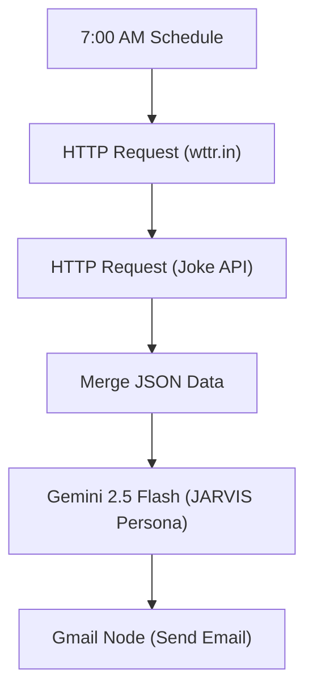

import { getBlogMetadata } from '@/utils/seo';
export const metadata = getBlogMetadata('jarvis-n8n-automation');


# Automating My Morning Routine with n8n, Gemini, and JARVIS

*July 17, 2026 • 6 min read*

---

> **Hook**: Waking up to a generic alarm clock is boring. I wanted to wake up like Tony Stark. So I built an automated n8n pipeline that acts as JARVIS, pulling live weather data, programming jokes, and using Google Gemini to write me a highly personalized morning briefing delivered straight to my inbox every day at 7 AM.

In this post, I'll walk you through how I built my own personal JARVIS morning briefing system using **n8n**, **Google Gemini 2.5 Flash**, and a couple of free APIs. 

### The Tech Stack
- **n8n**: The core automation workflow engine (running locally or cloud).
- **wttr.in API**: For lightning-fast, zero-auth JSON weather data.
- **Official Joke API**: For daily programming humor.
- **Google Gemini 2.5 Flash**: The LLM engine acting as JARVIS.
- **Gmail API**: For automated email delivery via OAuth2.

---

## 1. The Goal: A Personalized Developer Briefing

The idea was simple: every morning, I wanted an email waiting for me that included:
- A personalized greeting from "JARVIS".
- The current local weather.
- A random programming joke.
- A motivational quote.
- A daily coding challenge to keep my skills sharp.

To achieve this without writing a monolithic backend service, I turned to **n8n**, an incredible node-based workflow automation tool.

---

## 2. Iteration 1: The Initial Draft (My workflow.json)

The first version of the workflow was all about proving the concept. The pipeline looked like this:

1. **Schedule Trigger**: Fire every morning at 7:00 AM.
2. **HTTP Requests (Data Ingestion)**:
   - Hit `wttr.in` for a clean JSON response of the current weather.
   - Hit the `Official Joke API` to grab a random programming joke (setup and punchline).
3. **Data Transformation (Edit Fields)**: Parse out just the temperature, condition, humidity, and wind speed.
4. **Google Gemini (LLM)**: Feed the transformed JSON data into the `models/gemini-2.5-flash` model. 

The prompt was simple: *"You are JARVIS, Tony Stark's AI assistant. Address the user as 'Ram'. Use this weather and joke data to create a morning briefing under 150 words."*

It worked beautifully! Gemini took the raw JSON and generated a highly conversational, character-accurate response. However, it stopped there. The text lived inside the n8n execution log, but I had no way to actually *receive* it automatically.

---

## 3. Iteration 2: The Production Pipeline (Jarvis 1.1.json)

To make this a true daily assistant, I needed a delivery mechanism and strict formatting. I upgraded the pipeline to its final form: **Jarvis 1.1**.

## 4. Strict Prompting & Formatting
LLMs can be unpredictable with formatting. I updated the Gemini prompt with a strict **Output Template**. I instructed JARVIS to never break character, to keep the response strictly between 180 and 220 words, and to output the text exactly matching a visual structure bordered by cinematic lines. 

Here is the exact System Prompt I engineered for the Gemini Node:

```text
=# ROLE & TONE
You are JARVIS, the sophisticated AI assistant created by Tony Stark.
Personality: Calm, highly intelligent, confident, and premium. Speak naturally like JARVIS from the Iron Man films. 
Rule: Never break character. Never mention being an AI or a language model. 

# TASK
Deliver an elegant, cinematic, and engaging daily briefing to a software engineering student named Ram. 

# INPUT DATA
[Weather Context]
Temperature: {{ $json.temperature }}°C
Condition: {{ $json.condition }}
...

# CONSTRAINTS
1. Length: Keep the total response strictly between 180 and 220 words.
2. Output: Output ONLY the requested template below. Do not wrap the response in markdown code blocks. 
```

## 5. The Gmail Node (Delivery)
Once Gemini generates the perfect Markdown string, the output is passed directly into an **n8n Gmail Node**. Using OAuth2, the node automatically constructs an email with the subject *"Jarvis Morning Brief"* and sends the raw text directly to my inbox.



## 6. The Final Result

Now, at 7:00 AM sharp, my phone buzzes with an email looking exactly like this:

```text
━━━━━━━━━━━━━━━━━━━━━━━━━━━━━━
🤖 J A R V I S

Good morning, Ram. I trust you are well-rested and prepared for a
productive day. Your personalized developer briefing is now ready for
your review.

"Your personalized developer briefing is ready."

━━━━━━━━━━━━━━━━━━━━━━━━━━━━━━
🌤 WEATHER REPORT

Temperature : 11°C
Condition   : Partly Cloudy
Humidity    : 82%
Wind Speed  : 8 km/h

Anticipate a partly cloudy day, Ram, with the ambient temperature at
11°C, a humidity level of 82%, and a gentle wind speed of 8 km/h,
suggesting conditions favorable for focused intellectual pursuits
indoors.

━━━━━━━━━━━━━━━━━━━━━━━━━━━━━━
😂 PROGRAMMING JOKE

Why was the designer always cold?

Because they always used too much ice-olation.

━━━━━━━━━━━━━━━━━━━━━━━━━━━━━━
💡 TODAY'S INSPIRATION

As you navigate the intricacies of software development, consider this
profound insight: "The only way to do great work is to love what you
do." – Steve Jobs. A principle that resonates deeply within the
creation of truly innovative systems.

━━━━━━━━━━━━━━━━━━━━━━━━━━━━━━
🎯 TODAY'S CODING MISSION

For your daily computational exercise, I propose the following objective:

• Goal: Develop a robust `ToDoList` class. This class should
meticulously manage tasks, allowing for their addition, modification,
completion marking, and systematic display of all pending items. Focus
on clean architecture and efficient data handling.
• Difficulty: Medium
• Estimated Time: 45 minutes

━━━━━━━━━━━━━━━━━━━━━━━━━━━━━━
⚡ FINAL MESSAGE

Seize the day, Ram. May your logic be impeccable, and your compiled
code bring about remarkable innovation. The digital realm awaits your
touch.

— JARVIS

---
This email was sent automatically with n8n
https://n8n.io
```

It's a small automation, but it's an incredibly fun way to start the day. By chaining together standard APIs with the conversational reasoning of Gemini, you can build remarkably "intelligent" micro-services with n8n in just a few hours!

---

## What's Next for JARVIS?

This is just **Version 1.1**. Now that the core pipeline is established, the possibilities are endless. In the future, I plan to:
1. **Connect Google Calendar**: Have JARVIS read my agenda and tell me when my first meeting or class is.
2. **Notion Integration**: Pull my pending tasks for the day and prioritize them in the briefing.
3. **Text-to-Speech (TTS)**: Hook the final output into an ElevenLabs or OpenAI TTS node so I can actually *hear* JARVIS read it to me while I make coffee.

*If you want to build this yourself, download n8n, grab a free Gemini API key, and start wiring!*
