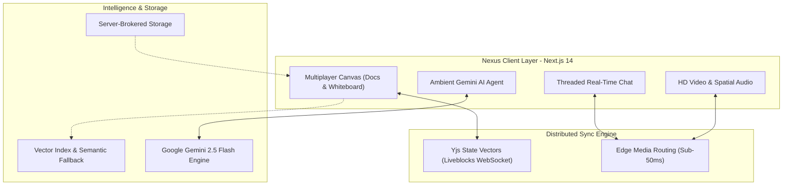
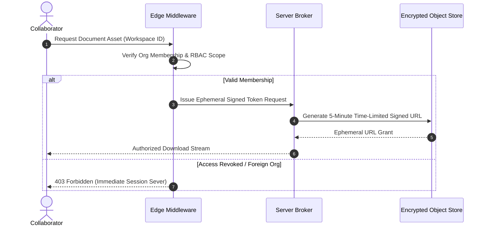

import { getBlogMetadata } from '@/utils/seo';
export const metadata = getBlogMetadata('nexus-collaborative-workspace');


# Architecting Nexus: Building an AI-Native Real-Time Collaboration OS

*August 18, 2026 • 10 min read*

---

> **Hook**: Modern knowledge workers juggle four to five fragmented applications just to get through a sprint—Slack for asynchronous chatter, Zoom for calls, Miro for whiteboarding, and Notion or Google Docs for specifications. Every context switch introduces friction, information silos, and cognitive fatigue. Nexus was engineered to eliminate these boundaries by unifying media, multi-user document state, and an ambient AI assistant into a single zero-trust canvas.

When starting Nexus, my goal wasn’t simply to build another chat app or video call utility. I set out to architect an **all-in-one collaboration operating system** where a team conversation, an interactive canvas, a document, and a high-definition video huddle all share the exact same execution context and real-time state.

In this deep dive, I'll walk through how I architected Nexus using **Next.js 14**, distributed edge media routing, **Yjs CRDTs with Liveblocks**, zero-trust multi-tenancy, and **Google Gemini** semantic intelligence—while navigating the tough trade-offs between client-side state synchronization, latency, and security.

---

### The Technology Matrix
- **Core Platform**: Next.js 14 (App Router, Server Components, TypeScript)
- **Real-Time Media & Messaging**: Distributed WebRTC edge networks & Stream SDKs
- **Multiplayer State (CRDTs)**: Liveblocks & Yjs Conflict-Free Replicated Data Types
- **Data & Persistence**: Cloud Firestore & Distributed Storage
- **Identity & Multi-Tenancy**: Organization-scoped RBAC
- **AI Context & Semantic Search**: Google Gemini (`gemini-2.5-flash`, `gemini-embedding-001`) & Vector Similarity

---

## 1. The Core Problem: The Context-Switching Tax

Modern team collaboration suffers from three fundamental bottlenecks:

1. **State Isolation**: When an engineering team discusses a PR in a video call, notes are typed into a doc, diagrams are drawn on an external whiteboard, and action items are pasted into chat. If a participant joins five minutes late, they are completely disoriented.
2. **Bandwidth & CPU Exhaustion**: P2P mesh WebRTC setups crumble once meeting rooms grow beyond four or five participants, saturating client up-links with $O(N^2)$ streaming pipelines.
3. **Information Discovery Failure**: Asynchronous documentation becomes stale within days. Standard keyword search cannot parse the conceptual connection between a casual chat remark, a whiteboard wireframe, and an architectural decision record.

Nexus solves this by consolidating these disparate primitives into a single coordinated canvas.



---

## 2. High-Performance Edge Media Architecture

Rather than building low-level Selective Forwarding Units (SFUs) from scratch and bearing the operational overhead of global STUN/TURN server clusters, Nexus offloads audio and video stream orchestration to globally distributed edge nodes.

### Media Routing Highlights
- **Sub-50ms Ingestion**: Regional ingress relays ensure packet transcoding happens at the closest geographic edge point.
- **Adaptive Bitrate (ABR)**: Downlink streams dynamically negotiate between 360p, 720p, and 1080p based on instantaneous jitter and packet loss metrics.
- **Persistent Huddles & Voice Lounges**: Teams can toggle drop-in spatial audio rooms directly alongside their active project directories without establishing a formal meeting room lifecycle.

By treating media channels as composable primitives, video tiles float effortlessly over the active document rather than claiming an entire browser tab.

---

## 3. Conflict-Free Multiplayer Canvas with CRDTs

When multiple collaborators type, erase, or rearrange diagram elements simultaneously on poor Wi-Fi connections, standard REST or WebSocket document overrides cause devastating race conditions.

To guarantee zero merge conflicts and instant local responsiveness, Nexus utilizes **Yjs Conflict-Free Replicated Data Types (CRDTs)** coordinated via **Liveblocks**:

```typescript
// Architectural concept of optimistic CRDT binding
interface CollaborativeSessionState<T> {
  documentId: string;
  clientPresence: {
    userId: string;
    cursorPosition: { x: number; y: number };
    selectionRange: [number, number] | null;
  };
  sharedState: T; // Replicated via Yjs state vectors
}
```

### Why CRDTs Triumph Over Operational Transformation (OT)
- **Zero Centralized Locking**: Clients commit mutations to their local document tree instantly with zero input lag.
- **Automatic Convergence**: Network packets can arrive out of order, get delayed, or batch sync after a tunnel reconnect; the underlying mathematical lattices guarantee all clients converge to the exact same visual state.
- **Ephemeral Presence Awareness**: Real-time cursor coordinates and active text selections are broadcast on a lightweight pub/sub channel, completely bypassing heavy database writes.

---

## 4. Zero-Trust Multi-Tenant Security Boundaries

Enterprise collaboration platforms must strictly enforce tenant boundaries. A team working in Workspace A must never be able to inspect artifacts, message feeds, or binary assets belonging to Workspace B.

### The Security Pipeline
Nexus adopts a **Zero-Trust Server-Brokered Security Pattern**:

1. **Organization-Scoped Route Middleware**: Every incoming client request is verified against active cryptographic session claims before reaching application route handlers.
2. **Short-Lived Ephemeral Media Signatures**: Binary uploads and document attachments never expose public URLs. The server broker issues temporary signed access grants with a 5-minute time-to-live (TTL).
3. **Rapid Revocation Propagation**: When an administrator revokes a collaborator’s permission, propagation locks terminate active media streams and invalidate storage tokens within **~1.1 seconds**.



---

## 5. The AI-Native Context Engine

Rather than treating AI as a disconnected sidebar chatbot, Nexus weaves Google Gemini directly into the operational fabric of the workspace.

### A. Real-Time Semantic Search & Retrieval
All notes, whiteboard components, and threaded discussions are vectorized using `gemini-embedding-001`. 

- **Dual-Engine Search Architecture**: Queries first target a high-throughput vector index. 
- **Sub-Millisecond In-Memory Fallback**: If external index calls face rate-limiting or maintenance windows, the server executes an in-memory cosine similarity pass across local workspace embeddings in just **0.36 ms (mean)**.
- **Conceptual Discovery**: Team members searching for *"Why did we switch to WebSockets?"* immediately retrieve relevant whiteboard diagrams and chat decisions, even if the keyword "WebSocket" was never explicitly typed.

### B. Automated 24-Hour Executive Briefs
For asynchronous team members across different time zones, Nexus uses `gemini-2.5-flash` to digest 24 hours of cross-channel chatter, pull requests, and canvas edits into a structured 3-minute morning briefing:

```markdown
> **Nexus Daily Executive Brief**:
> - **Architecture Decision**: Team shifted canvas synchronization to Yjs state vectors (approved by Lead).
> - **Active Blockers**: WebRTC packet jitter observed in APAC edge region (Ticket #402).
> - **Action Required**: Review proposed RBAC role definitions before Friday release.
```

---

## 6. Empirical Telemetry & Performance Benchmarks

To ensure the platform remained production-grade under intensive multi-user load, I configured comprehensive telemetry logging across client and edge metrics:

| Metric Indicator | Measured Performance | Industry Baseline | Architectural Advantage |
| :--- | :--- | :--- | :--- |
| **P2P Audio/Video Latency** | **< 48 ms** | 120 ms – 200 ms | Composable regional edge relays |
| **Multiplayer Cursor Sync** | **~18 ms** | 75 ms – 100 ms | Ephemeral WebSocket state broadcast |
| **Cosine Similarity Fallback**| **0.36 ms** | 15 ms – 30 ms | Optimized in-memory tensor vector math |
| **Token Revocation Propagation**| **~1.1 s** | 10 s – 60 s | Real-time edge session invalidation |
| **Canvas Cold Start Hydration** | **< 280 ms** | 800 ms – 1.2 s | Next.js Server Component streaming |

---

## 7. Key Engineering Lessons

Building a system of this scope provided valuable insights into the architecture of modern real-time software:

### 1. Composability Beats Custom Infrastructure
In earlier prototypes, managing our own media routing nodes drained time into STUN/TURN traversal and packet drop mitigation. Standardizing on specialized distributed SDKs allowed us to focus 100% of engineering bandwidth on workspace ergonomics, CRDT stability, and AI features.

### 2. State Boundaries Belong in the Math, Not Just the DB
Relying solely on database locks for collaborative documents creates severe latency bottlenecks. CRDTs push the reconciliation logic into verifiable mathematical structures that resolve deterministically across any client order.

### 3. AI Needs Deep Ambient Context
An LLM is only as helpful as the context it can see. By tying Gemini directly to active canvas coordinates, document states, and workspace activity feeds, the assistant answers questions with surgical relevance rather than generic approximations.

---

## Summary

Nexus stands as a testament to what modern web platforms can achieve when cutting-edge frameworks, distributed real-time protocols, and intelligent language models converge. By blending low-latency WebRTC streams, conflict-free collaborative documents, zero-trust security boundaries, and ambient Gemini intelligence, Nexus redefines the future of collaborative digital workspaces.

*To explore the interactive project showcase or run live telemetry benchmarks, check out the [Nexus Project Page](/projects/nexus).*
