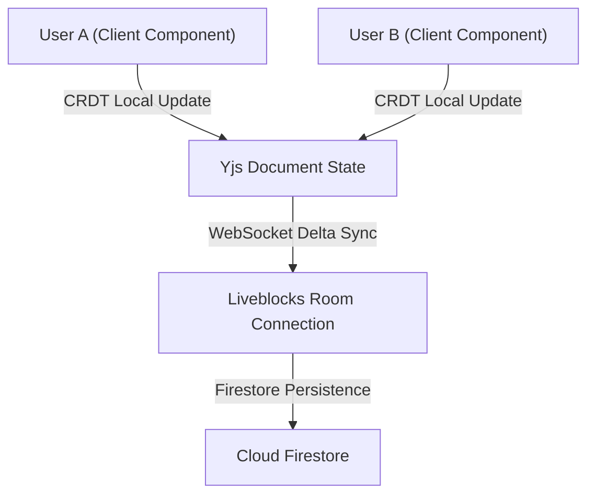

import { getBlogMetadata } from '@/utils/seo';
export const metadata = getBlogMetadata('nexus-part1-foundation-collaboration');


# Building Nexus (Part 1): The Foundation & Real-Time Collaborative Canvas

*July 13, 2026 • 9 min read*

---

> **Hook**: Standard chat and video tools live in separate tabs, isolated from the documents and designs teams actually work on. I built Nexus to destroy these seams—creating an AI-native collaboration operating system where a conversation, a document, a whiteboard, and a meeting are parts of the same unified context.

In this first post of our three-part engineering series, I'll walk through the foundation of **Nexus**. We'll look at how we transitioned away from legacy WebRTC mesh networks, structured secure tenant environments, and implemented real-time multiplayer canvas synchronization.

---

## 1. The Composability Shift: Standardizing on SDKs

In my previous projects, I spent significant time managing Selective Forwarding Units (SFUs) using custom media servers like LiveKit. While educational, running STUN/TURN servers and handling global media transcoding is a massive infra burden. 

For Nexus, the architectural philosophy shifted to **composability** and **managed edge services**:

- **Core Framework**: Next.js 14 (App Router)
- **Multi-Tenant Identity**: Clerk (with Clerk Organizations)
- **Real-Time Media & Chat**: Stream Video & Chat SDKs
- **Dynamic Database**: Firestore (Firebase)
- **Multiplayer State (CRDTs)**: Liveblocks + Yjs
- **Styling**: Tailwind CSS & shadcn/ui

By offloading global audio/video routing to Stream’s globally distributed edge networks, we guaranteed sub-50ms latency and 1080p resolution while keeping the codebase focused entirely on collaborative features.

---

## 2. Multi-Tenant Guardrails via Clerk

Enterprise applications require rigorous data boundaries. Nexus implements workspace-scoped routes, meaning a user cannot access messages, whiteboards, or files unless they belong to that workspace's Clerk Organization.

```typescript
// Example of middleware workspace checking
import { authMiddleware, redirectToSignIn } from "@clerk/nextjs";

export default authMiddleware({
  afterAuth(auth, req) {
    // If not authenticated, send to login
    if (!auth.userId && !auth.isPublicRoute) {
      return redirectToSignIn({ returnBackUrl: req.url });
    }
    
    // Scoped workspace routing
    const pathSegments = req.nextUrl.pathname.split('/');
    const workspaceId = pathSegments[2];
    
    if (workspaceId && auth.orgId !== workspaceId) {
      // Prevent cross-organization access
      return Response.redirect(new URL('/select-workspace', req.url));
    }
  }
});
```

Using Clerk Organizations, we bound user sessions directly to workspace database entries (`/workspaces/{workspaceId}`). When a workspace is created, we create the database document and Clerk Org atomically.

---

## 3. The Shared Canvas: Livekit/Socket.io vs. Yjs/Liveblocks

A primary objective was creating a document and whiteboard system where multiple users can write and sketch together with zero lag. In early iterations, we relied on simple WebSockets (Socket.io) to push mouse coordinates, but this model crumbles under high concurrency because it doesn't handle state conflicts.

To solve this, we integrated **Yjs CRDTs (Conflict-Free Replicated Data Types)** back-ended by **Liveblocks**.



### Text Collaboration (BlockNote)
For document editing, we wrapped a BlockNote editor with Yjs. As keys are pressed, Yjs resolves concurrent conflicts locally, and Liveblocks handles the low-latency delta broadcasts. Cursors display real-time user selections and names.

### Whiteboard Collaboration
The whiteboard uses a canvas where shapes, drawings, and notes are represented as a CRDT tree. When a user drags a node or changes a color:
1. The canvas state applies the change locally.
2. The change is formatted as an update slice and sent to the Liveblocks room.
3. If offline, the changes buffer locally and merge seamlessly once connection is restored.

---

## 4. Persistent Communication

Our video meetings and persistent chat run side-by-side. 
- **Stream Video SDK**: Generates instant workspace huddles and scheduled meetings. The UI hooks cleanly into native audio output nodes, facilitating easy screen-sharing and participant gallery grids.
- **Stream Chat SDK**: Powers channel text threads, file sharing, reactions, and typing indicators. When a call ends, the chat remains persistent, giving the team a permanent record of the context.

## What's Next?

With the real-time foundation and collaborative canvas complete, the next challenge was workspace organization. In **Part 2**, we will cover the creation of the **Workspace Home dashboard**, a **Universal Inbox** to track mentions across spaces, and a structured **Folder Navigation** system for files.

*Check out the [GitHub Repository](https://github.com/Vaibhav-1819) to follow the latest commits!*
