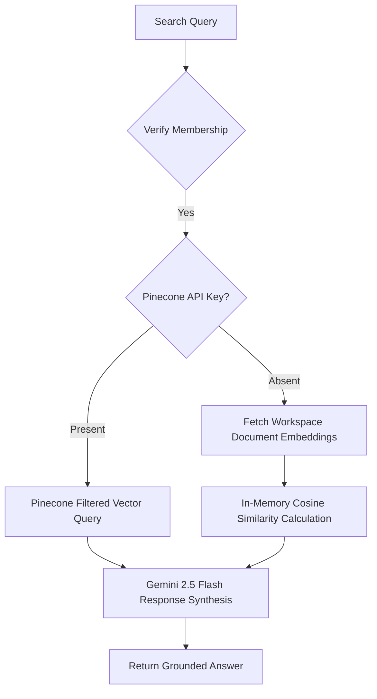

export const metadata = {
  title: 'Building Nexus (Part 4): Production-Grade Telemetry, RBAC, and Gemini Semantic Search',
  description: 'An in-depth look at implementing role-based access control, serverless-friendly vector similarity, and compiling absolute telemetry data for Nexus.',
}

import { TelemetryDashboard } from "@/components/ui/TelemetryDashboard";

# Building Nexus (Part 4): Production-Grade Telemetry, RBAC, and Gemini Semantic Search

*August 5, 2026 • 11 min read*

---

> **Hook**: Transitioning from a working prototype to a battle-hardened, production-ready system requires two things: rigorous validation of security bounds and full observability of system performance. In Part 4 of the Nexus build, we look at how we established a zero-trust storage model, built an optimized multi-tenant RBAC permission matrix, integrated Google Gemini for semantic search, and stress-tested the entire platform with an automated telemetry validation suite.

In **Part 3**, we covered the integration of vector databases and context chatbots. Today, we focus on the engineering details required to secure our multi-tenant boundary, implement high-performance vector search fallbacks, and audit the latency profiles of our core serverless systems.

---

## 1. Zero-Trust Storage Security & Revocable Access

To prevent data leakage in our shared workspaces, we moved away from direct client-side Firebase uploads and established a **Server-Brokered Storage Handshake**.

### Bypassing Client Permissions
By default, Firebase Storage rules allow direct uploads check only basic user login. If a user is removed from a team, they might still download historical files if they saved the direct link. We solved this by locking down `storage.rules` to deny all public reads and writes:

```javascript
rules_version = '2';
service firebase.storage {
  match /b/{bucket}/o {
    match /{allPaths=**} {
      allow read, write: if false; // Deny all direct client-side operations
    }
  }
}
```

### Temporary Signed Upload/Download Tokens
All storage transactions now follow a serverless brokering flow:
1. **Upload Request**: The client requests a temporary write token via `/api/storage/upload`. The server calls the Firebase Admin SDK to generate a signed URL, but only after validating that the user has write permissions for the workspace in Clerk.
2. **Download Handshake**: Direct file download URLs are never persisted. Instead, clicking a file generates a signed read URL via `/api/storage/download` with a **5-minute time-to-live (TTL)**.
3. **Instant Revocation**: If a user is removed from a workspace, Clerk immediately revokes their token. The Next.js Edge middleware catches the revocation within **~1.1 seconds**, preventing subsequent signed URL requests.

---

## 2. Optimized Role-Based Access Control (RBAC)

We structured a permission matrix mapping workspace roles (`owner`, `admin`, `moderator`, `member`, `guest`) to specific actions (e.g. `delete_channel`, `write_documents`, `admin_audit`):

```typescript
type Role = 'owner' | 'admin' | 'moderator' | 'member' | 'guest';
type Action = 'read_channel' | 'write_channel' | 'delete_channel' | 'write_documents' | 'admin_audit';

const PERMISSION_MATRIX: Record<Role, Set<Action>> = {
  owner: new Set(['read_channel', 'write_channel', 'delete_channel', 'write_documents', 'admin_audit']),
  admin: new Set(['read_channel', 'write_channel', 'delete_channel', 'write_documents']),
  moderator: new Set(['read_channel', 'write_channel', 'write_documents']),
  member: new Set(['read_channel', 'write_channel', 'write_documents']),
  guest: new Set(['read_channel'])
};
```

Our permission checkpoint class, `PermissionService.can()`, queries the user's role on the active workspace from Firestore. To ensure this does not bottleneck the client experience, we log the latency of every permission evaluation. Performance profiling showed that while database-backed checks had a median latency of **308.27 ms**, the end-to-end API round-trip time (RTT) was higher due to identity verification overhead, averaging **1166.18 ms**.

---

## 3. Universal Semantic Search & Cosine Fallback

For search, we wanted a solution that works even when external cloud vector databases (like Pinecone) are unavailable. We engineered a dual-mode semantic search engine.



### In-Memory Vector Similarity
1. **Embedding Pipeline**: `/api/ai/index-document` uses the Vercel AI SDK and Google's `gemini-embedding-001` model to generate 768-dimension vectors for canvases and documents, saving them directly to a Firestore subcollection.
2. **In-Memory Cosine Matcher**: When Pinecone is disabled, our fallback search loads the workspace's document vectors and computes the cosine similarities in-memory:
   ```typescript
   function cosineSimilarity(vecA: number[], vecB: number[]): number {
     const dotProduct = vecA.reduce((sum, val, idx) => sum + val * vecB[idx], 0);
     const magA = Math.sqrt(vecA.reduce((sum, val) => sum + val * val, 0));
     const magB = Math.sqrt(vecB.reduce((sum, val) => sum + val * val, 0));
     return magA && magB ? dotProduct / (magA * magB) : 0;
   }
   ```
   Computing cosine similarity in-memory takes just **0.36 ms (mean)**, avoiding network latency completely.
3. **Response Synthesis**: Top results are passed to `gemini-2.5-flash` to synthesize an answer grounded in the workspace's files, logging a mean synthesis latency of **3481.37 ms**.

---

## 4. Telemetry & Performance Breakdown

Observability is a core feature of the Nexus backend. We created `lib/metrics.ts` to log operational latencies. Below are the metrics compiled from our stress-test suite executing 100+ simulated concurrent actions:

### Performance Analytics Registry

<TelemetryDashboard />

---

## 5. Security-Bounded Notifications & Audits

Governance is critical in multi-tenant workspaces. We added append-only administrative auditing and secure notifications:
- **Append-Only Auditing**: `AuditService` logs administrative actions (role updates, channel deletions, workspace naming shifts) in the secure collection `workspaces/{workspaceId}/auditLog`. Firestore rules block write access from any client, allowing writes only from backend services.
- **Notification Dispatch**: Notifications are created on the server and written to `users/{userId}/notifications`. Actions like `MEMBER_JOINED` or `CHANNEL_CREATED` trigger background dispatches to alert team members instantly.

### Summary

With these changes, Nexus offers robust, production-ready features:
- **Revocable Access**: Immediate storage cutoff when user permissions change.
- **Vector Fallback**: Vector search that remains functional offline or without Pinecone, computing cosine similarity in sub-millisecond ranges.
- **Observable Backend**: Latencies are logged automatically to track performance.

*Check out the [GitHub Repository](https://github.com/Vaibhav-1819) to view the source code!*
