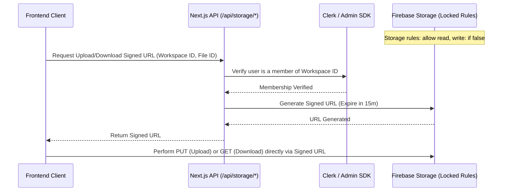

export const metadata = {
  title: 'Building Nexus (Part 3): The AI-Native Layer & Zero-Trust Security Architecture',
  description: 'Architecting the final pieces of Nexus: building server-brokered storage security, OpenAI activity briefs, and Pinecone-based semantic search.',
}

# Building Nexus (Part 3): The AI-Native Layer & Zero-Trust Security Architecture

*July 16, 2026 • 10 min read*

---

> **Hook**: A collaboration tool is only as good as the trust it commands. In the final phase of building Nexus, we had to address two critical engineering concerns: how to secure team data in a zero-trust model, and how to harness generative AI to act as a workspace-wide memory bank. Here is how we locked down our storage rules and wired up an intelligent, context-aware AI assistant.

In **Part 1** and **Part 2**, we established the real-time canvas and workspace features of Nexus. Today, we conclude the series by breaking down the security architecture and the AI integration that elevates Nexus into an intelligent, enterprise-ready platform.

---

## 1. Zero-Trust Storage Security: Bypassing spark constraints

Our security audit highlighted a common vulnerability: client-side Firebase uploads relying on loose Firestore rules (e.g. checking auth but not organization boundaries). Furthermore, public download URLs never truly expire, meaning a user removed from a workspace could still download historical files if they saved the URL.

We closed this gap by implementing **Server-Brokered Storage Security**:



1. **Storage Rules Lockout**: We set `storage.rules` to deny all public read/write requests:
   ```javascript
   rules_version = '2';
   service firebase.storage {
     match /b/{bucket}/o {
       match /{allPaths=**} {
         allow read, write: if false; // Block direct client requests
       }
     }
   }
   ```
2. **Server-Brokered Uploads**: The frontend uploads via signed URLs generated by `/api/storage/upload`. The API route checks workspace membership before returning the temporary URL.
3. **Revocation-Gap Security**: Files are never served publicly. When clicking a file to download, the client requests a temporary download link via `/api/storage/download`, which expires after 15 minutes. If a user is removed from a workspace in Clerk, they can no longer generate signed URLs, instantly losing access.

---

## 2. Universal Semantic Search via Pinecone

Rather than performing basic keyword matching on chat messages, we implemented **Workspace Memory** using **Pinecone Vector Database** and **OpenAI Embeddings**.

```typescript
// Liveblocks webhook handler syncing canvas documents to Pinecone
export async function POST(req: Request) {
  const payload = await req.json();
  
  if (payload.type === "room.storageUpdated") {
    const { roomId } = payload.data;
    const workspaceId = getWorkspaceIdFromRoom(roomId);
    
    // Fetch document snapshot from Firestore
    const docSnap = await adminDb.collection(`workspaces/${workspaceId}/documents`).doc(roomId).get();
    const docData = docSnap.data();
    
    if (docData) {
      // 1. Generate Embedding
      const embeddingResponse = await openai.embeddings.create({
        model: "text-embedding-3-small",
        input: docData.title + "\n" + docData.textPlain,
      });
      const vector = embeddingResponse.data[0].embedding;

      // 2. Sync to Pinecone index
      const index = pinecone.Index(process.env.PINECONE_INDEX!);
      await index.upsert([{
        id: roomId,
        values: vector,
        metadata: {
          workspaceId,
          title: docData.title,
          type: "document"
        }
      }]);
    }
  }
}
```

- **Index Webhook**: A webhook listening to Liveblocks saves generates embeddings for canvases and indexes them on Pinecone. We built a fallback sweep cron job (`/api/ai/cron/index-sweep`) running via Vercel to index any missed documents.
- **Secure Retrieval**: Searches are made using `/api/ai/search` which verifies the user's workspace membership and queries Pinecone, passing the `workspaceId` as a metadata filter to isolate query results.
- **CMD+K Palette**: Users can hit `Cmd+K` anywhere in the app to ask natural language questions ("*What decisions were made about security?*") and receive cited context slices.

---

## 3. Context-Aware AI Chat & Daily Briefs

### Floating Context Assistant
Inside Document and Whiteboard pages, we embedded a floating chatbot sidebar (`ContextAssistant.tsx`). Built with the **Vercel AI SDK**, it streams responses using `gpt-4o-mini`. 
When a user asks the assistant a question, the client packages the active canvas JSON state and injects it as a system prompt parameter, enabling context-specific queries:

```typescript
// Prompt injection in /api/ai/chat
const activeCanvasContent = req.body.canvasState;
const systemPrompt = `You are the Nexus Assistant. You are analyzing a document in real-time. 
Active Document Content:
---
${activeCanvasContent}
---
Use the above content to answer user queries with citation.`;
```

### Daily Brief Summaries
To prevent teams from getting lost in Slack-style scroll logs, we built `/api/ai/brief`. It aggregates the past 24 hours of logs (meetings, messages, documents edited) and formats a short, daily summary. To optimize LLM cost and guarantee all workspace members see the same update, the daily brief is cached at `/workspaces/{workspaceId}/dailyBriefs/{YYYY-MM-DD}`.

---

## 4. UI Polish: Solving SSR Hydration Errors

During deployment, we encountered standard Next.js Server-Side Rendering (SSR) hydration warnings (e.g. `ChunkLoadError` and DOM mismatch). This occurred because Clerk's client providers were inside `<body>` tags. 

We resolved this by placing `<ClerkProvider>` outside the `<html>` tag in `app/layout.tsx`. This ensures server and client HTML trees match precisely during the initial page load, accelerating Time-To-Interactive (TTI).

---

## Summary of the Journey

Through these three phases, Nexus evolved from a simple video calling mock into a multi-tenant, secure, AI-native collaboration platform:
- **Part 1**: Structured edge video grids and collaborative CRDT canvasses.
- **Part 2**: Built unified workspaces, notifications, and files infrastructure.
- **Part 3**: Wrapped the architecture in a zero-trust model and infused AI workspace memory.

Nexus represents a masterclass in modern web engineering—showing how standard cloud APIs can be composed to build complex, low-latency, and intelligence-driven products.

*Check out the [GitHub Repository](https://github.com/Vaibhav-1819) to view the source code!*
